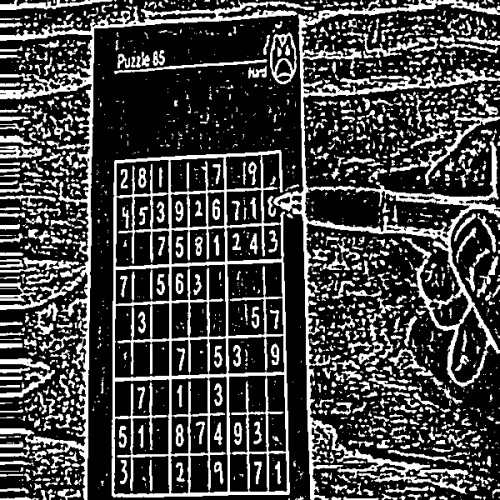
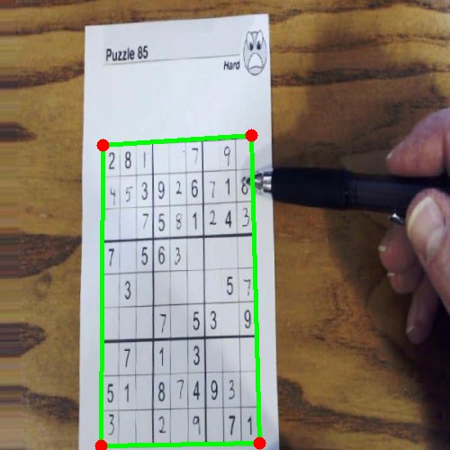

# Sudoku Solver

Extract and solve Sudoku puzzles from photos. Point your camera at a puzzle, get the solution.

**Stack:** Python (FastAPI, OpenCV, PyTorch) + Vanilla HTML/CSS/JavaScript

## Results

| Stage | Metric |
|-------|--------|
| **Grid Detection** | 34/38 (89%) on real newspaper photos |
| **Digit Recognition** | 62% filled-cell accuracy, 93% empty-cell accuracy |
| **Solver** | <1ms median for valid puzzles |

Tested against 38 ground-truth-annotated newspaper photos.

## How It Works

| 1. Input | 2. Preprocess | 3. Detect |
|:---:|:---:|:---:|
|  |  |  |

| 4. Warp | 5. OCR | 6. Solve |
|:---:|:---:|:---:|
|  |  |  |

**Grid Detection** — CLAHE contrast enhancement + adaptive thresholding, then contour detection with structure-aware scoring. Each candidate quad is warped and checked for grid-like interior (evenly-spaced lines, ~81 cell-sized regions). A 4-step fallback chain handles varying lighting, faded print, and extreme contrast.

**Digit Recognition** — 102K-parameter CNN trained on MNIST + font-rendered printed digits + synthetic empty cells. Deploys as a 24KB ONNX model. 14x faster than Tesseract with per-cell confidence scores.

**Solver** — Backtracking with constraint propagation and MRV heuristic. Deterministic, solves any valid puzzle in under 40ms.

## Features

- **Camera-first web UI** — capture directly from phone or webcam
- **Pipeline debug visualizer** (`/debug`) — every intermediate step with tunable parameters
- **Piecewise perspective correction** — 8-point warp handles curved newspaper paper
- **Ground truth evaluation** — 38 annotated images, automated parameter sweeps, OCR benchmarking

## Quick Start

```bash
git clone https://github.com/DataEdd/Sudoku-Solved.git
cd Sudoku-Solved
python -m venv venv && source venv/bin/activate
pip install -r requirements.txt
uvicorn main:app --reload
```

Visit http://localhost:8000

## License

MIT
