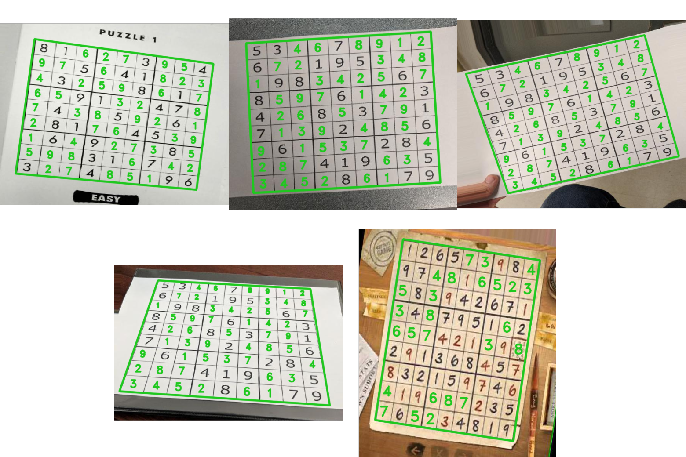
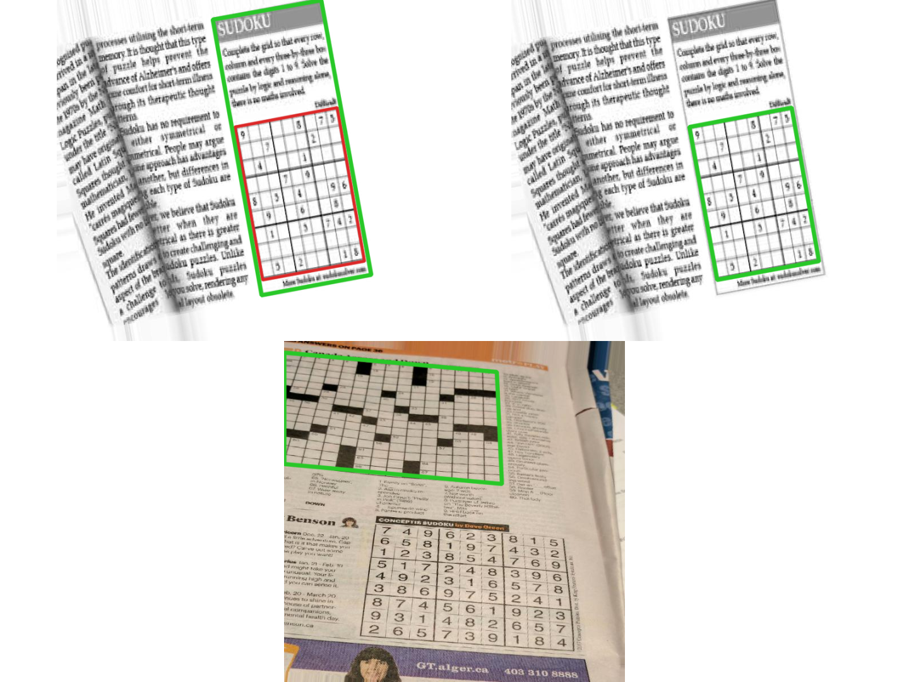
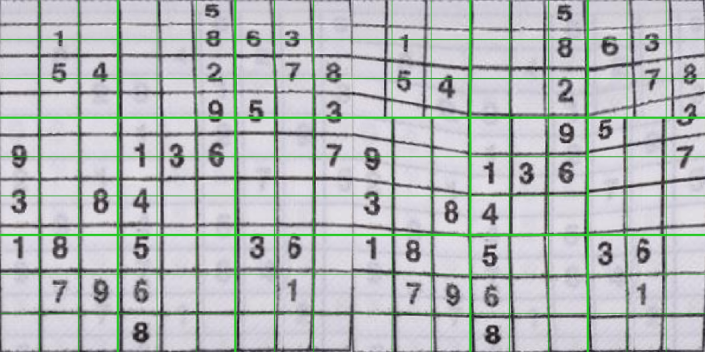

# Sudoku Solver


Photograph a Sudoku, get it back solved. A single FastAPI service that runs a custom CV detector, a 102K-parameter CNN for digit recognition, and MRV-ordered backtracking — wired end-to-end and measured against 38 hand-annotated newspaper photos.



## How it works

Four stages. Source lives in [`app/`](app/); each stage has a deep-dive notebook in [`notebooks/`](notebooks/).

| 1. Input | 2. Preprocess | 3. Detect |
|:---:|:---:|:---:|
|  |  |  |

| 4. Warp | 5. OCR | 6. Solve |
|:---:|:---:|:---:|
|  |  |  |

**1. Detection — [`app/core/extraction.py`](app/core/extraction.py).** A 4-step deterministic contour fallback chain. The first step that returns a valid quadrilateral wins; later steps only run if earlier ones failed. Each step is a different preprocessing recipe targeting a specific real-world failure mode. Full walk-through in [`notebooks/01_detection.ipynb`](notebooks/01_detection.ipynb).

```text
                Input image (BGR)
                      │
                      ▼
    ┌─────────────────────────────────────────┐
    │ Step 1  RETR_TREE                       │
    │         + 5-component structure score   │  ── hit ──┐
    │         (grid_structure + cell_count)   │           │
    └─────────────────────────────────────────┘           │
               │ miss                                     │
               ▼                                          │
    ┌─────────────────────────────────────────┐           │
    │ Step 2  morph dilate=3, erode=5         │  ── hit ──┤    first
    │         RETR_EXTERNAL + classical score │           │    success
    └─────────────────────────────────────────┘           │    wins
               │ miss                                     │
               ▼                                          │
    ┌─────────────────────────────────────────┐           │
    │ Step 3  aggressive CLAHE (clip=6, C=7)  │  ── hit ──┤
    │         RETR_EXTERNAL + classical score │           │
    └─────────────────────────────────────────┘           │
               │ miss                                     │
               ▼                                          │
    ┌─────────────────────────────────────────┐           │
    │ Step 4  morph dilate=3, erode=3         │  ── hit ──┤
    │         RETR_EXTERNAL + classical score │           │
    └─────────────────────────────────────────┘           │
               │ miss                                     │
               ▼                                          │
          (None, 0.0)                                     │
                                                          ▼
                              corners [TL, TR, BR, BL] + confidence
```

**2. Scoring — [`app/core/extraction.py`](app/core/extraction.py).** Step 1 produces dozens of candidate quads per image. A 5-term weighted score picks the winner: three classical quad primitives (area, squareness, centeredness) plus two structure-aware terms that warp each candidate to 200×200 and ask *does the interior look like a 9×9 grid?* — a line-peak check targeting ~10 peaks per axis, and a connected-component check targeting ~81 cell-sized regions. Why those weights, why those checks: [`notebooks/02_scoring.ipynb`](notebooks/02_scoring.ipynb).

**3. Digit recognition — [`app/ml/`](app/ml/).** A 102,026-parameter CNN: three Conv-BN-ReLU blocks (32 → 64 → 128 channels) → adaptive pooling → a two-layer FC head with dropout. Trained on MNIST (labels 1-9 only — class 0 means *empty cell*), 4,500 system-font-rendered printed digits from 67 allowlist-validated Latin-digit fonts, Chars74K held-out fonts, and synthetic empty-cell variants calibrated against the benchmark GT distribution. Deployed via ONNX Runtime — `requirements-deploy.txt` is PyTorch-free. Architecture, training data, and error taxonomy: [`notebooks/03_ocr.ipynb`](notebooks/03_ocr.ipynb).

**4. Solving — [`app/core/solver.py`](app/core/solver.py).** MRV-ordered backtracking with per-cell domain restriction: at each recursive step, pick the empty cell with the fewest remaining candidates, try each in turn, recurse on a hit, undo on a dead end. 0.42 ms median on the 38-puzzle benchmark. Follows the classical CSP skeleton from Kamal, Chawla & Goel (2015) [[1]](#references); MRV is the single enhancement on top. Why backtracking beat simulated annealing and why constraint propagation is a future direction: [`notebooks/04_solving.ipynb`](notebooks/04_solving.ipynb).

## Lessons learned

### 1. Measure end-to-end from day one.

Detection was benchmarked against 38 hand-annotated images while OCR had no real-photo validation for weeks. The data to grade OCR was already there — every GT entry had a 9×9 digit grid sitting next to its corner annotations — nobody had bothered to write `evaluate_ocr.py` that actually used them. When I finally did, the first honest pipeline number came in far below what the component-level metrics would have predicted. Strong component metrics don't compose into strong system metrics; only end-to-end measurement against external ground truth catches that.

### 2. I designed my own candidate scoring. It wasn't wrong, but it was wrong in interesting ways.

Detection papers mostly report binary hit/miss; I wanted something richer, so the detector emits a continuous 0-1 area/shape score that ranks every candidate quad. Starting point was the classical three-term version from the literature: `area + squareness + centeredness`. That works most of the time and fails in an interesting way. On image `_33_`, it ranks the enclosing *SUDOKU* article panel — a rectangle that contains the header, the instructions, *and* the grid — above the Sudoku grid itself. The correct answer scores lower than a wrong answer that happens to be larger and equally square. The fix is two structure-aware terms that warp each candidate to 200×200 and probe the interior for 9×9-grid-like content (a line-peak count and a cell-component count). With those added, the grid wins on `_33_`.



*Top-left — classical 3-term score on `_33_`: green quad is the top-ranked candidate (the *SUDOKU* article panel); red is the Sudoku grid, ranked below. Top-right — same image, 5-term structure-aware score: green quad is the Sudoku grid, now the top-ranked candidate. Bottom — `_4_`, a newspaper page with a crossword above a Sudoku: the green quad is the top 5-term candidate — still the crossword.*

But the structure-aware score isn't a general fix — it has its own limits. Image `_4_` is the residual failure mode: a newspaper page with a crossword above the Sudoku. The 5-term score still picks the crossword, because the structure check rewards *anything* that looks like a regular grid — 9×9 Sudokus, 15×15 crosswords, and word-search puzzles all pass the line-peak and cell-count tests. No geometry-plus-structure score operating on a single quad can tell them apart; the distinguishing signal is ink density (sparse digits for Sudoku, dense black blocks for crosswords), which isn't currently encoded anywhere in the pipeline. The broader point: any self-designed score only sees the signals you bothered to encode. Mine captures geometry and interior line structure. It doesn't capture density, layout semantics, or adjacency relationships between multiple candidates — so the failure modes it has left are legible rather than arbitrary, but they're still there.

### 3. The classifier is not where the accuracy points live.

Instinct after the first OCR benchmarks came in was "train a bigger CNN." Decomposing the gap against ground truth tells a different story:

- Production pipeline (detector → 4-point warp → CNN): **66.6 %** filled-cell accuracy.
- Replace the detector with perfect outer corners (same warp, same classifier): **78.5 %** (**+11.9** pts).
- Add an 8-point piecewise interior warp on top (same classifier): **84.7 %** (**+6.2** pts).
- Remaining 15.3 pts are everything downstream of a perfect warp — classifier ceiling plus hard-ambiguity cases (handwritten-over-printed, toilet-paper sudoku, a cat sitting on the page).

On a curved-paper image, the 4-point warp stretches the grid to a square by its 4 outer corners and leaves the interior bowed against the algorithm's ideal lines. The 8-point piecewise warp uses the interior ⅓ / ⅔ intersection corners as additional anchors and straightens each 3×3 box independently — real grid lines line up with the algorithm's overlay:



*Left — 4-point warp of image `_19_` (toilet-paper Sudoku): the algorithm's straight grid overlay drifts off the real cell boundaries. Right — 8-point piecewise warp on the same image: grid lines align with the overlay.*

The engineering arc went 4-point → 8-point piecewise (recovers +6.2 filled-cell points with manually-annotated interior corners; production needs an automatic interior-corner detector before this can ship, which is a grid-line detection problem on the already-warped image). A per-cell warp (one homography per Sudoku cell, ~100 interior corners to detect) would chase more of the residual, but the 8-point version isn't in production yet — that's where the next measured win actually lives.

A later experiment confirmed the decomposition the hard way. An architecture ablation suggested a 4× larger CNN; I promoted it, retrained at full protocol, and it **regressed** on real-photo filled-cell accuracy by 1.4 pts despite matching synthetic test numbers. The larger classifier is *more* sensitive to upstream warp distortion, not less. Rolled back. Classifier capacity isn't the bottleneck when the input distribution is being shaped by upstream pipeline stages.

### 4. Fallback chains beat single-method detectors on photos in the wild.

Most grid-detection papers — including the Wicht 2014 paper this project benchmarks against — pick one method (Hough transform, DBN) and tune it well. That approach broke for me on real newspaper photos: every problem image has its own failure mode, and no single preprocessing recipe covers all of them. The first three detectors I wrote (standard Hough, generalized Hough, Sobel edges, line-segment detection) fell over on the first real image I threw at them.

What shipped is a 4-step fallback chain where each step is a specific failure case made permanent in code:

| Step | Rescues | Root cause |
|---|---|---|
| 1. `RETR_TREE` + 5-term structure score | 29 / 34 | Grid nested inside a larger panel (`_33_`) |
| 2. Morph dilate-then-erode (net thinning) | `_39_` | Fragmented contours |
| 3. Aggressive CLAHE (clip=6, thresh_c=7) | `_17_`, `_24_` | Faint print |
| 4. Symmetric morph closing (dilate=erode=3) | `_23_`, `_26_` | Broken grid lines |

Detection rate on the internal 38-image benchmark is 34/38 (89.5 %); on the external Wicht V2 test set it's 38/40 (95 %) — both comfortably ahead of Wicht's published ~87.5 % Hough baseline. The win isn't method sophistication — it's ensembling different preprocessors against a ground-truth-backed failure catalogue.

## Run it yourself

```bash
git clone https://github.com/DataEdd/Sudoku-Solved
cd Sudoku-Solved
python -m venv venv && source venv/bin/activate
pip install -r requirements-deploy.txt      # inference-only deps (no PyTorch)
uvicorn main:app --reload
# → http://localhost:8000
```

The production UI is at `/`. An interactive pipeline visualizer lives at `/debug` — upload a photo and walk every intermediate stage with adjustable preprocessing knobs. No public live demo is part of this project; the steps above get it running locally in under a minute.

To retrain the CNN, re-run benchmarks, or regenerate the images in this README:

```bash
pip install -r requirements.txt              # full dev deps
python -m app.ml.train                       # 30 epochs, ~15 min CPU / ~5 min MPS
python -m app.ml.export_onnx --verify        # .pth → committed ONNX layout + parity check
pytest tests/test_e2e_pipeline.py            # 5 regression tests against the 38-image set
python -m evaluation.evaluate_detection      # detector benchmark
python -m evaluation.evaluate_ocr            # OCR benchmark
python -m evaluation.benchmark_solver        # solver latency benchmark
python -m scripts.build_readme_assets        # rebuild every image this README references
```

Each benchmark writes its results to `evaluation/*_results.json`; every number cited in the Lessons section above is reproducible from a clean checkout.

## Roadmap

- **Automatic interior-corner detector** — wire `extract_cells_piecewise` into `/api/extract` so production gets the +6.2 measured filled-cell points. The hard part is building a robust detector for the ⅓ / ⅔ intersection corners on the already-warped grid: candidates are morphological line projection, Hough-line clustering near the expected ⅓ and ⅔ rows/cols, or a Harris response filtered to near-ideal positions.
- **Real-photo training data** — current training is zero-shot on real newspaper photos (MNIST + rendered printed digits + synthetic empties). Adding a disjoint real-photo training split should close the largest remaining OCR gap.
- **Grid-extent and sudoku-vs-crossword disambiguation** in the scoring function to close the two residual detection failure modes where the scorer picks a quad adjacent to the grid instead of the grid itself.

## References

<a id="references"></a>

1. **S. Kamal, S. S. Chawla, N. Goel**. *Detection of Sudoku Puzzle using Image Processing and Solving by Backtracking, Simulated Annealing and Genetic Algorithms: A Comparative Analysis.* ICIIP 2015.
2. **B. Wicht, J. Hennebert**. *Camera-based Sudoku recognition with Deep Belief Network.* ICoSoCPaR 2014. [IEEE Xplore](https://ieeexplore.ieee.org/document/7007986).
3. **A. Bhattarai et al.** *A Study of Sudoku Solving Algorithms: Backtracking and Heuristic.* arXiv:2507.09708, 2025.

## License

MIT on the code. The 38-image benchmark dataset in `Examples/Ground Example/` is CC BY 4.0 (derived from [wichtounet/sudoku_dataset](https://github.com/wichtounet/sudoku_dataset)).
