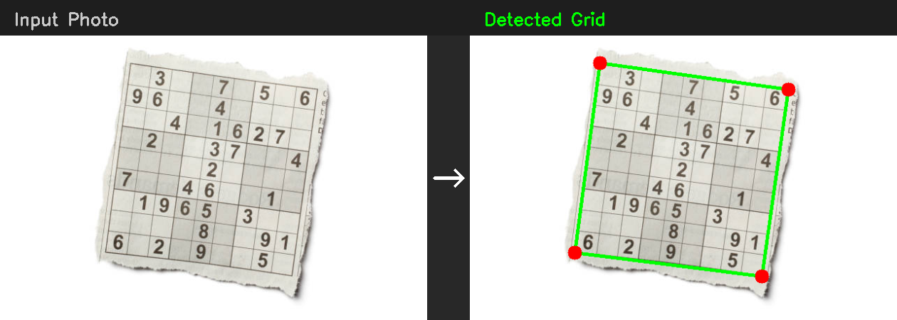

# Sudoku Solver

A web application that extracts Sudoku puzzles from photos and solves them. Features a custom CNN for digit recognition trained on MNIST, a backtracking solver, and a camera-first mobile UI.



## How It Works

```
Photo  -->  Grid Detection  -->  Cell Extraction  -->  CNN OCR  -->  Solver  -->  Solution
            (contour-based)     (perspective warp)    (99.5% acc)   (backtracking)
```

### 1. Grid Detection

Hybrid contour detection with CLAHE preprocessing finds the puzzle boundary:

1. **CLAHE enhancement** normalizes lighting across the image
2. **Adaptive thresholding** converts to binary, handling shadows and glare
3. **Contour detection** finds the largest convex quadrilateral
4. **Sub-pixel corner refinement** via `cv2.cornerSubPix` for precise warping

Benchmarked across 20 images with 5.4px average warp deviation.

### 2. Cell Extraction

Perspective transform straightens the detected grid to a top-down square, then splits into 81 cells. For curved newspaper photos, piecewise perspective correction uses 8 annotated points (4 outer + 4 center-box corners) to straighten interior grid distortion.

### 3. CNN Digit Recognition

Custom PyTorch CNN replaces Tesseract OCR:

| | CNN | Tesseract |
|---|---|---|
| **Accuracy** | 99.5% | ~90% |
| **Speed (81 cells)** | 223ms | 3,189ms |
| **Confidence scores** | Per-cell softmax | None |
| **Dependencies** | PyTorch (bundled model) | System binary |

**Architecture** (102K parameters):

```
Input (1, 28, 28)
  -> Conv2d(1, 32) -> BatchNorm -> ReLU -> MaxPool
  -> Conv2d(32, 64) -> BatchNorm -> ReLU -> MaxPool
  -> Conv2d(64, 128) -> BatchNorm -> ReLU -> AdaptiveAvgPool
  -> Linear(128, 64) -> ReLU -> Dropout(0.3)
  -> Linear(64, 10)
```

Trained on MNIST (60K digits) + 5K synthetic empty cells with augmentation (rotation, affine warp, noise, blur). 30 epochs on Apple MPS, 5.4 minutes total.

**Per-class accuracy:**

| 0 (empty) | 1 | 2 | 3 | 4 | 5 | 6 | 7 | 8 | 9 |
|---|---|---|---|---|---|---|---|---|---|
| 99.8% | 99.7% | 99.5% | 99.8% | 99.6% | 99.1% | 99.0% | 99.4% | 99.5% | 98.8% |

### 4. Solver

Two solving algorithms, selectable via API:

**Backtracking** (default) -- constraint propagation with MRV heuristic:
- Deterministic, guaranteed to find the unique solution
- Solves any valid puzzle in under 40ms

**Simulated Annealing** -- physics-inspired stochastic optimization:
- Initializes each 3x3 box with missing digits
- Swaps non-fixed cells to minimize row/column conflicts
- Cooling schedule with periodic reheating

| Puzzle | Backtracking | Simulated Annealing |
|--------|-------------|-------------------|
| Easy | 0.5ms, 51 nodes | 679ms, 57K iters |
| Medium | 38ms, 3.3K nodes | Failed (500K iters) |
| Hard | 18ms, 1.7K nodes | Failed (500K iters) |

## Architecture

```
main.py                              # FastAPI server
app/
  api/v1/endpoints/sudoku.py         # POST /api/extract, POST /api/solve, GET /api/health
  core/
    extraction.py                    # Grid detection + perspective transform + cell extraction
    ocr.py                           # DigitRecognizer protocol, Tesseract/CNN backends
    solver.py                        # Backtracking + simulated annealing solvers
    verifier.py                      # Puzzle validation + solution verification
  ml/
    model.py                         # SudokuCNN architecture (102K params)
    dataset.py                       # MNIST + synthetic empty cell dataset
    train.py                         # Training script with early stopping
    recognizer.py                    # CNNRecognizer: batch inference + confidence
    checkpoints/sudoku_cnn.pth       # Trained model weights
  models/schemas.py                  # Pydantic request/response models
evaluation/
  benchmark.py                       # Detection method benchmark runner
  results.json                       # Benchmark data (20 images, 3 methods)
  LOG.md                             # Detailed findings and analysis
templates/index.html                 # Frontend UI
static/                              # JS, CSS, PWA assets
Examples/                            # Test images
```

## Quick Start

### Prerequisites

- Python 3.10+
- Tesseract OCR (optional fallback): `brew install tesseract`

### Run locally

```bash
git clone https://github.com/DataEdd/Sudoku-Solved.git
cd Sudoku-Solved
python -m venv venv && source venv/bin/activate
pip install -r requirements.txt
uvicorn main:app --reload
```

Visit http://localhost:8000

### API

```bash
# Extract grid from image (returns grid + per-cell confidence scores)
curl -X POST http://localhost:8000/api/extract \
  -F "file=@Examples/unsolved/sudoku-puzzle.jpg"

# Solve with backtracking (default)
curl -X POST http://localhost:8000/api/solve \
  -H "Content-Type: application/json" \
  -d '{"grid": [[5,3,0,0,7,0,0,0,0],[6,0,0,1,9,5,0,0,0],[0,9,8,0,0,0,0,6,0],[8,0,0,0,6,0,0,0,3],[4,0,0,8,0,3,0,0,1],[7,0,0,0,2,0,0,0,6],[0,6,0,0,0,0,2,8,0],[0,0,0,4,1,9,0,0,5],[0,0,0,0,8,0,0,7,9]]}'

# Solve with simulated annealing
curl -X POST http://localhost:8000/api/solve \
  -H "Content-Type: application/json" \
  -d '{"grid": [[5,3,0,...]], "method": "simulated_annealing"}'

# Health check
curl http://localhost:8000/api/health
```

### Train the CNN

```bash
python -m app.ml.train              # Full training (30 epochs, ~5 min on MPS)
python -m app.ml.train --epochs 10  # Quick run
```

### Run detection benchmarks

```bash
python -m evaluation.benchmark
python -m evaluation.visualize_results
```

## Detection Benchmark

Tested 7 detection approaches on 23 images (clean scans, rotated augmentations, real photos):

| Method | Detection Rate | Median Time | Approach |
|--------|---------------|-------------|----------|
| **Contour** | **100% (23/23)** | **2ms** | Adaptive threshold + largest quadrilateral |
| Hough Polar | 91% (21/23) | 1,368ms | Polar Hough + angle filtering |
| Sudoku-Detector | 78% (18/23) | 5ms | CLAHE + contour + sub-pixel refinement |
| Simple Baseline | 70% (16/23) | 2ms | Sobel gradient + contour |
| Hough Standard | 70% (16/23) | 16ms | HoughLinesP + line clustering |
| Sobel+Flood | 61% (14/23) | 2ms | Sobel edges + flood fill |
| Line Segment | 57% (13/23) | 6ms | Canny + extremal line intersections |

Full analysis in [evaluation/LOG.md](evaluation/LOG.md).

## What I Learned

1. **Simple beats clever for detection.** The contour method (threshold + find biggest shape) outperformed Hough transforms, flood fill, and line intersection methods. Adaptive thresholding handles lighting variation; the "largest quadrilateral" heuristic is surprisingly robust.

2. **Self-reported confidence is meaningless.** Sobel+Flood reports 1.00 confidence but only detects 61% of images. The only honest evaluation is running against ground truth.

3. **CNN crushes Tesseract for this task.** 14x faster, higher accuracy, and provides calibrated confidence scores. The 102K-parameter model trains in 5 minutes and runs inference on 81 cells in 223ms.

4. **Backtracking with MRV is the right solver.** Simulated annealing is interesting but fails on medium/hard puzzles. Backtracking with the Minimum Remaining Values heuristic solves any valid puzzle in under 40ms.

5. **Curved paper is the real challenge.** Flat image detection is solved. The hard problem is newspaper photos where the paper curves -- 4-corner perspective transform produces uneven cell spacing. Piecewise 8-point correction addresses this but requires interior grid point annotation.

## Tech Stack

- **Backend:** Python, FastAPI, OpenCV, PyTorch
- **OCR:** Custom CNN (102K params, 99.5% accuracy)
- **Solver:** Backtracking with constraint propagation + MRV
- **Frontend:** Vanilla HTML/CSS/JavaScript, PWA-ready
- **Detection:** Contour-based with CLAHE + adaptive threshold + sub-pixel refinement

## License

MIT
